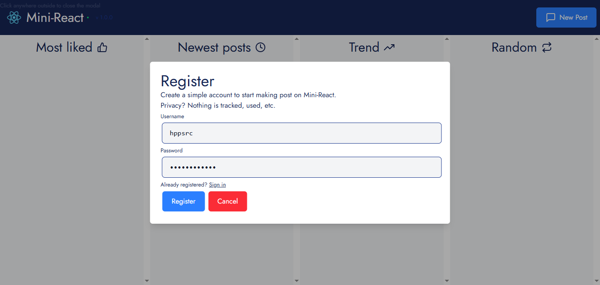
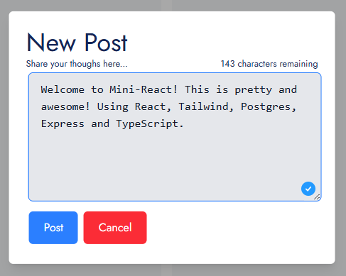
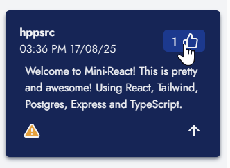

# Mini-React ⚛️

<div align="center" style="display: flex; justify-content: space-around">
	
	
	
	
	
	
	
	
</div>

<br />

Mini-React is a personal mini-project used to practice Fullstack development using
<span> React</span>
for frontend,
<span> Express</span>
for backend, and
<span> Supabase</span>
for database. Additionally, the
<span> TypeScript</span>
language ensures better data integrity. Designed for PaaS platforms like
<span> Vercel</span>.

Current version: **1.0.0**

*What can you do?*

- Create a user, log in, delete account.
- Create, rate, report posts.

## Getting Started 🎯

### Dependencies / Requirements 🗃️

#### Requirements

- ``Node.js``: v18+ (required for Express 5.x)
- ``TypeScript``: ^5.8.3
- ``pnpm``: Recommended for package management

#### Dependencies

| Type | Package |
|-|-|
| **Server** | ``@supabase/supabase-js (^2.52.0)``, ``argon2 (^0.43.1)``, ``cookie-parser (^1.4.7)``, ``cors (^2.8.5)``, ``csrf-csrf (^4.0.3)``, ``dayjs (^1.11.13)``, ``dotenv (^17.2.0)``, ``express (^5.1.0)``, ``helmet (^8.1.0)``, ``jsonwebtoken (^9.0.2)`` |
| **Client** | ``@tailwindcss/vite (^4.1.11)``, ``dayjs (^1.11.13)``, ``react (^19.1.0)``, ``react-dom (^19.1.0)``, ``react-feather (^2.0.10)``, ``zustand (^5.0.7)`` |
| **Development (Server)** | ``@types/cookie-parser (^1.4.9)``, ``@types/cors (^2.8.19)``, ``@types/express (^5.0.0)``, ``@types/jsonwebtoken (^9.0.10)``, ``@types/node (^24.0.15)``, ``nodemon (^3.1.10)``, ``ts-node (^10.9.2)``, ``tsx (^4.20.3)``, ``typescript (^5.8.3)`` |
| **Development (Client)** | ``@eslint/js (^9.30.1)``, ``@types/react (^19.1.8)``, ``@types/react-dom (^19.1.6)``, ``@vitejs/plugin-react-swc (^3.10.2)``, ``autoprefixer (^10.4.21)``, ``eslint (^9.30.1)``, ``eslint-plugin-react-hooks (^5.2.0)``, ``eslint-plugin-react-refresh (^0.4.20)``, ``globals (^16.3.0)``, ``postcss (^8.5.6)``, ``tailwindcss (^4.1.11)``, ``typescript (^5.8.3)``, ``typescript-eslint (^8.35.1)``, ``vite (^7.0.4)`` |


### Download ⬇️

*No download required.*

### Installing ⚙️

*No installation required.*

## Run/Build yourself 🛠️

### Configuration

#### .env

The project requires specific settings in the <span> ``.env``</span> file located at ``/server/.env``

Expected content:

```js
SUPABASE_KEY = STRING
SUPABASE_URL = URL
JWT_SECRET = STRING		// <= Use random hex data, longer is better
ISDEV = true // <= ONLY in your local/dev
```

#### Supabase

> [!WARNING] The database normalization level is 2 (NF2)
> During development, a controlled denormalization was implemented to avoid refactoring all frontend code (using triggers). THIS ***SHOULDN'T*** CAUSE ISSUES. Future updates will modify this. Check the repository's ``schema.sql`` file for changes.

Please see the [SQUEMA.md](docs/SQUEMA.md) file (a complete ``schema.sql`` file will be added soon).

> [!WARNING]
> Before building or running, you must add an
<span> ``.env``</span>
> file with your
<span> Supabase</span>
> credentials
> Jump to the [Configuration](#configuration) section

### Run

1. Clone the repository:

   `git clone https://github.com/hppsrc/mini-react.git`

2. Navigate to the project directory:

   `cd mini-react`

3. Install dependencies:

   `pnpm install`

4. Run the application:

   Development mode:
   ```bash
   pnpm app			# Runs both client and server
   # or individually:
   pnpm client		# Client only
   pnpm server		# Server only
   ```

   > [!TIP]
   > For better performance, you can use Bun:
   > - Full stack: `pnpm app-bun`
   > - Client: `pnpm client-bun`
   > - Server: `pnpm server-bun`

5. Open in your browser:

	`http://localhost:5173/`

### Build

1. Clean previous builds (optional):
   ```bash
   pnpm dist-clean		# Cleans both client and server
   # or individually:
   pnpm client-clean	# Cleans client/dist
   pnpm server-clean	# Cleans server/dist
   ```

2. Build the application:
   ```bash
   pnpm app-build		# Builds both client and server
   # or individually:
   pnpm client-build	# Builds client with Vite
   pnpm server-build	# Builds server with TypeScript
   ```

3. Run in production:
   ```bash
   pnpm dist			# Runs the server in production mode
   ```

4. Open in your browser

	`http://localhost:3000/`

> [!NOTE]
> The production server will serve both the API and the static files from the client build.

### Using Mini-React 💻

1. Open in your browser

	https://hppsrc.site/mini-react

2. Create an user (for free)

	

3. Create your first post

	

4. Like it!

	

<!-- ## Help ❓

Check the **Wiki** section in the GitHub repository:
[GitHub Wiki](https://github.com/hppsrc/mini-react/wiki)
Contributions to the wiki are welcome! -->

## License 🔑

This project is licensed under the GNU General Public License v3.

## TODO ✔️

- [ ] Responsive design
- [ ] Improve server security
- [ ] Code cleanup
- [ ] Post editing/deleting
- [ ] User badges
- [ ] Add more features
- [ ] QOL updates.

## Known Errors 🐞

Report issues in the **Issues** section:
[GitHub Issues](https://github.com/hppsrc/mini-react/issues) (only for issues)

Open a new issue for bugs or support requests.
